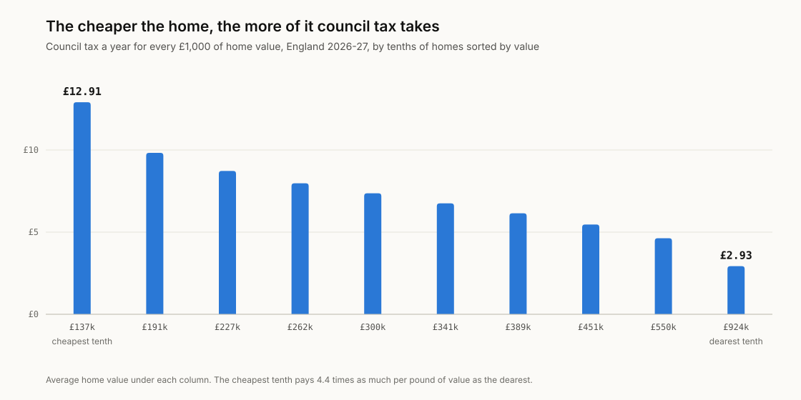
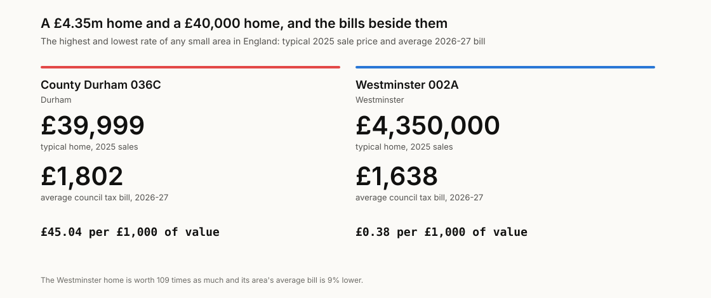
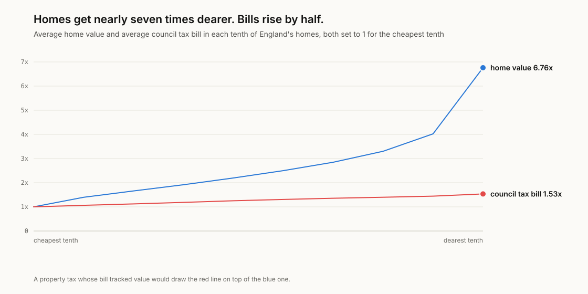
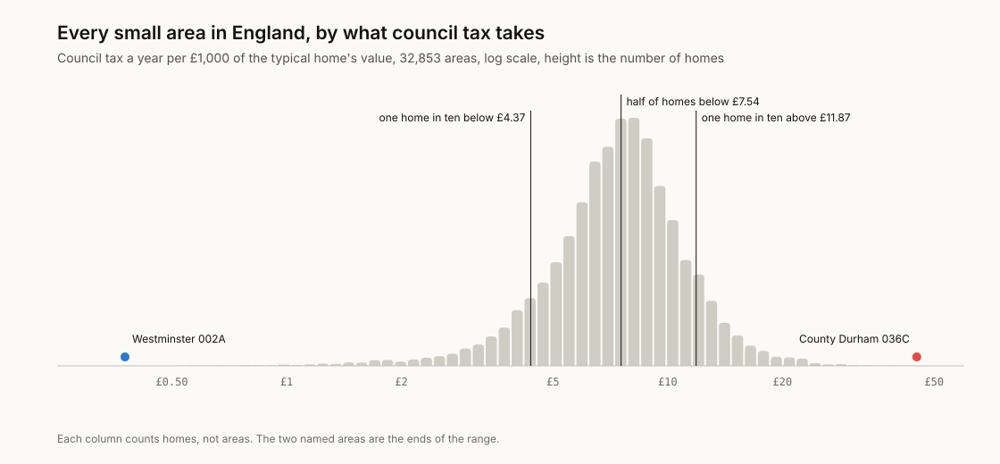
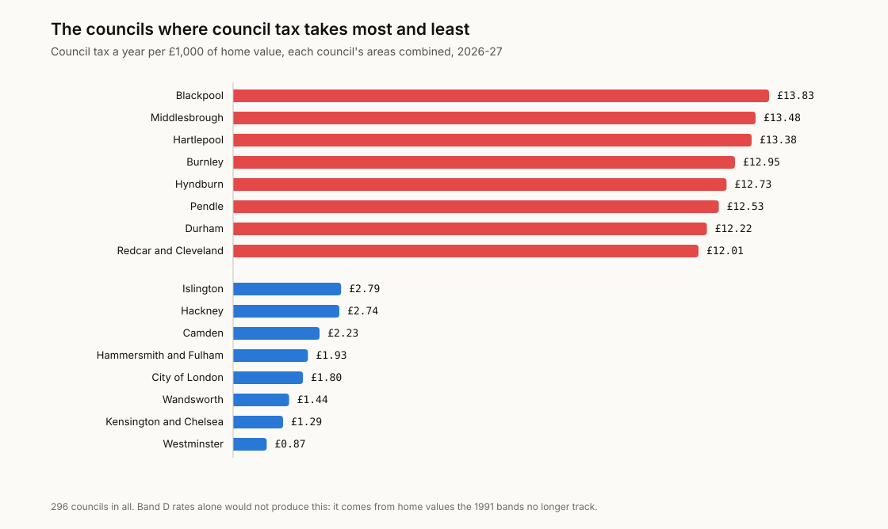
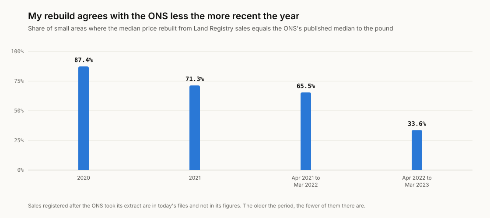

# band-d

Council tax in England is still worked out from what each home would have sold
for on 1 April 1991. Nobody has bought a house at 1991 prices in over thirty
years, and the system has never once been asked to notice. This measures what
that now means, in every one of England's 32,853 small areas with enough sales
to value: how many pounds of council tax a year each area pays for every
£1,000 its homes are worth.

**Try it with your postcode:** [finntech3.github.io/band-d](https://finntech3.github.io/band-d/)

**Why I built this.** I wanted to know what my own council tax band was
actually buying me, and a band letter turned out to be a much worse guide to
that than I assumed going in. So I stopped trusting the letter and built the
rate instead.

## The finding

**The cheaper the home, the more of its value council tax takes.** Split
England's homes into ten equal groups by value. The cheapest tenth pays £12.91
a year for every £1,000 its homes are worth. The dearest tenth pays £2.93.
That is 4.4 times as much per pound. The dearest homes are worth 6.8 times the
cheapest, but their bills are only 1.53 times bigger.

<picture>
  <source media="(prefers-color-scheme: dark)" srcset="docs/figures/rate-by-value-dark.svg">
  
</picture>

At the two ends of England, the gap stops being a ratio and becomes absurd:

| | Typical home, 2025 | Average bill, 2026-27 | Per £1,000 of value |
|---|---:|---:|---:|
| County Durham 036C | £39,999 | £1,802 | £45.04 |
| Westminster 002A | £4,350,000 | £1,638 | £0.38 |

The Westminster home is worth 109 times the Durham one. Its bill is 9% lower.

<picture>
  <source media="(prefers-color-scheme: dark)" srcset="docs/figures/extremes-dark.svg">
  
</picture>

**What I think this means.** Council tax is usually argued about as a question
of which band a home is in, or which council sets the bill. Both are the
smaller part of it, and both are more fun to argue about than the actual
cause, which is a spreadsheet nobody has opened since John Major was in
office. Most of the spread comes from differences in value the bands cannot
see: prices that have moved apart since 1991, and a top band that charges
three times the bottom one however much more the home is worth. A tax built
like that will charge the cheapest homes most for what they are worth,
whichever council sets the rate. Blaming your council for this is a bit like
blaming a shop for a price tag that was printed in 1991 and laminated shut.

<picture>
  <source media="(prefers-color-scheme: dark)" srcset="docs/figures/bill-vs-value-dark.svg">
  
</picture>

That is not a new argument. The Institute for Fiscal Studies made it for
England as a whole in [*Revaluation and reform: bringing council tax in England
into the 21st century*](https://ifs.org.uk/publications/revaluation-and-reform-bringing-council-tax-england-21st-century)
(Adam and others, 2020). What this adds is every small area, on 2025 sales and
2026-27 bills, reconciled to the government's own figures before any of it is
compared.

## The numbers

All from `python -m bandd.report`, which refuses to print them if a check fails.

**Coverage.** 32,853 small areas holding 25,273,055 homes. Another 902 areas
(612,295 homes) had fewer than five sales in 2025 and are left out, following
the ONS's rule for small-area medians.

**England as a whole** pays £5.92 of council tax a year per £1,000 of home
value: all the tax in the covered areas over the value of all their homes.

**Across areas**, weighted by the homes in them, the rate runs:

| 1st percentile | 10th | 25th | Median | 75th | 90th | 99th |
|---:|---:|---:|---:|---:|---:|---:|
| £1.87 | £4.37 | £5.87 | £7.54 | £9.41 | £11.87 | £19.52 |

The median area pays more than England as a whole (£7.54 against £5.92)
because England's total value is concentrated in the expensive areas that pay
the lowest rates.

<picture>
  <source media="(prefers-color-scheme: dark)" srcset="docs/figures/spread-dark.svg">
  
</picture>

**By council**, the highest are Blackpool (£13.83), Middlesbrough (£13.48) and
Hartlepool (£13.38). The lowest are Westminster (£0.87), Kensington and
Chelsea (£1.29) and Wandsworth (£1.44). Westminster's Band D bill is £1,049.55,
Durham's is £2,622.15.

<picture>
  <source media="(prefers-color-scheme: dark)" srcset="docs/figures/councils-dark.svg">
  
</picture>

**Where the spread comes from.** The log of an area's rate is the log of its
council's Band D, plus the log of its average band ratio, minus the log of its
home value. Splitting the variance of the rate across those three terms:

| Home values the bands do not track | Band mix | Council Band D rates |
|---:|---:|---:|
| 113% | -28% | 15% |

Shares can pass 100% because the terms pull against each other. Dearer areas
do sit in higher bands, which claws back 28% of the spread, but values differ
far more than the bands allow for. Councils' own rates matter least.

**A flat charge, as arithmetic.** If every home paid £5.92 per £1,000 of its
value, raising exactly the same total, 69% of homes would pay less. The average
change by tenth of value, cheapest first:

| 1 | 2 | 3 | 4 | 5 | 6 | 7 | 8 | 9 | 10 |
|---:|---:|---:|---:|---:|---:|---:|---:|---:|---:|
| -£959 | -£750 | -£644 | -£553 | -£436 | -£299 | -£93 | £182 | £659 | £2,893 |

This is not a proposal. It is the size of the gap the bands leave, expressed in
pounds. Any real reform would have to deal with people whose home is worth far
more than their income, which a flat charge ignores.

## Verify before you interpret

Nothing above is computed until four checks against published figures pass.
Each has a twin test that feeds it something deliberately wrong and must fail,
so a check that cannot fail does not count as a check.

| Check | Against | Result | Its twin |
|---|---|---|---|
| Band ratios | MHCLG tax base, tables 1.26 and 1.27 | 2,664 council and band cells rebuilt with the statutory ninths; largest gap 0.03 of a Band D home | one wrong ratio, or bands spaced evenly, fails |
| Council charges | MHCLG Table 10, 2026-27 | own Band D plus county, police, fire and combined authority equals the published total for all 296 councils, to the penny | dropping one precept fails |
| Homes by band | VOA valuation list against councils' tax base | 98.6% of councils agree on total homes to within 1%; the typical council's band shares agree to 0.05 of a point | reading every band into the next column fails |
| House prices | ONS small-area medians (HPSSA 46) | rebuilt sale by sale from the Land Registry, 87.4% of areas match to the pound for 2020 | medians pulled towards the mean, or the years in reverse order, fail |

The house price check deserves a note, because it is the one that did not
match first time. Rebuilt medians match the ONS exactly in 87.4% of areas for
2020, 71.3% for 2021, 65.5% for the year to March 2022 and 33.6% for the year
to March 2023. A method error would miss every year alike. This misses more
the more recent the year, which is what sales registered after the ONS took its
copy of the Land Registry would do. The median gap is £0 in every year but the
last. So the check passes on that shape: a high exact share in the oldest year,
a zero median gap there, and agreement falling with each later year.

<picture>
  <source media="(prefers-color-scheme: dark)" srcset="docs/figures/price-check-dark.svg">
  
</picture>

The app does the arithmetic again from the raw inputs, in TypeScript, and its
tests require it to land on the pipeline's quantiles and extremes exactly, to
the last bit.

## How it works

- **Bills.** Each small area's homes by band come from the VOA's stock of
  properties (31 March 2025). An area's average bill is its council's total
  Band D bill for 2026-27, including county, police, fire, combined authority
  and average parish charges, times the average band ratio of its homes.
- **Values.** Every standard sale (category A) in HM Land Registry's Price Paid
  Data for 2025, placed in its 2021 small area through the ONS postcode lookup
  of May 2026. That is 794,690 sales. A typical home is the median; areas with
  fewer than five sales are left out.
- **The rate.** £ of council tax a year per £1,000 of value: the average bill
  over the typical price for an area, and total tax over total value (built
  from mean prices) for England, its tenths and its councils.

There is more on each choice in [docs/DESIGN-DECISIONS.md](docs/DESIGN-DECISIONS.md),
and every source, address and checksum is in [docs/SOURCES.md](docs/SOURCES.md).

## What this leaves out

- **Sales, not all homes.** The median sale is a good guide to what an area's
  homes are worth, but homes that sell are not a random sample of homes.
- **Discounts and support.** The single person discount, exemptions and council
  tax support all cut real bills, mostly at the bottom. This compares the bills
  the bands set, before any of them.
- **Parishes.** Parish charges are averaged across each council, so an area in
  a parish with a high precept pays a little more than shown, and one with none
  a little less.
- **England only.** Wales revalued in 2003 and has nine bands. Scotland sets
  its own band ratios. Neither can be put on the same scale.
- **Suppressed bands.** The VOA publishes "-" where a band holds one to four
  homes. They are counted as 2.5. Counting them as 1 or 4 moves the cheapest
  tenth's rate between £12.87 and £12.94 and leaves the dearest at £2.93.
- **Medians against means.** On mean prices rather than medians the spread
  narrows a little (10th to 90th percentile £4.08 to £11.03, against £4.37 to
  £11.87) and nothing changes order.

## What I got wrong first

- **My opening line was false.** I started from "a semi in Blackpool pays more
  than a £5m townhouse in Kensington". In pounds it does not: Band H pays twice
  Band D, and Kensington and Chelsea's Band D is £1,667. The true version is
  about the rate against value, which is what this measures.
- **I planned to use the ONS's small-area prices directly.** Their latest
  release covers the year to March 2023, so current prices had to be rebuilt
  from the Land Registry's individual sales, which is why the price check
  exists.
- **I expected the rebuild to match the ONS exactly.** It matched a third of
  areas in the latest year. Before treating that as a failure I checked it by
  year, found the pattern late registrations would leave, and rewrote the check
  to test for that pattern. I have tried to be honest that the check was
  redesigned after seeing the data; its twins are there to show it still fails
  on a real method error.
- **I first used mean prices for single areas.** Westminster 019E's 2025 mean
  was £6.0m because of one £34m sale; its median was £2.55m. Area rates now
  use the median.
- **Two councils vanished from a join.** Barnsley and Sheffield took new codes
  after a boundary change and the VOA still uses the old ones. They are mapped
  by hand, in one place, with a comment.
- **The value tenths depended on file order.** Areas with the same median were
  grouped in the order the VOA lists them, which the app could not reproduce.
  Ties are now broken by area code. Two middle tenths moved by a penny.

## Running it

Python 3.11 or later, standard library only for the analysis.

```sh
python -m pip install pytest
PYTHONPATH=pipeline/src python -m bandd.report     # every number above
python -m pytest pipeline/tests                    # checks, twins, analysis
python scripts/make_figures.py                     # redraw docs/figures
PYTHONPATH=pipeline/src python -m bandd.build      # the app's data
```

The raw Land Registry and postcode files are too large to commit. The small
files the analysis reads are in `data/derived`, with the SHA-256 of every raw
file they came from; `scripts/build_prices.py` rebuilds them from a fresh
download.

The app, in `web/`, needs Node 22:

```sh
cd web
npm ci
npm test          # the app's arithmetic against the pipeline's
npm run dev
```

## License

MIT for the code. The data belongs to its publishers and is used under the Open
Government Licence v3.0; HM Land Registry data is Crown copyright and database
right 2026.
